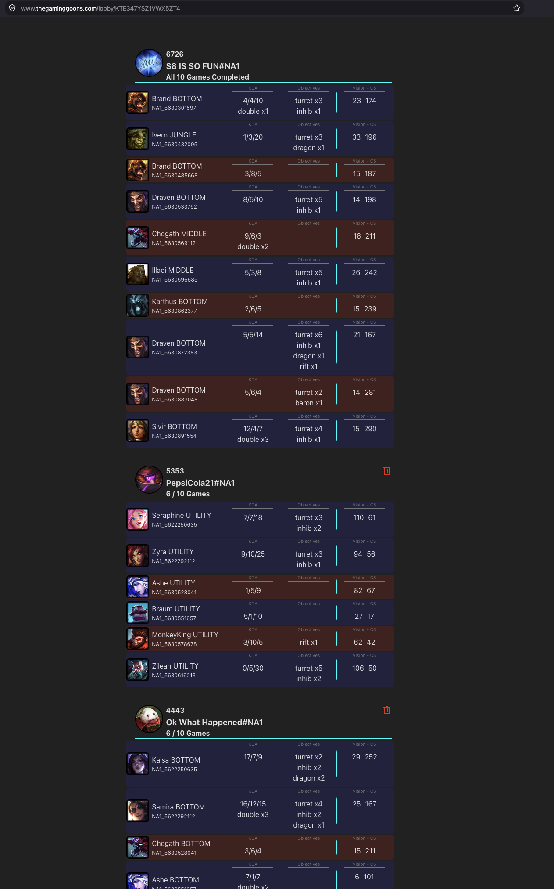

# League of Legends Fantasy League

A leaderboard that you can create and add your friends to see who's the best.

> **Note:** This project currently only supports players in the North America (NA) region.

## How it Works
- **Get Started**: Head to [thegaminggoons.com](https://www.thegaminggoons.com).
- **Create a Lobby**: Type your summoner name and create your lobby.
- **Invite Friends**: Share your lobby via the link in your browser's **address bar**.
- **Start the Competition**: Once everyone has joined, click the **"Start"** button to begin tracking your next **ten** games.
- **Win**: The person with the highest score after completing all ten games wins!

## Scoring
Your total score is calculated by summing the objectives you achieve across your matches, each multiplied by a specific value defined in the project's `scoring.toml` file.

**Example Multipliers:**
- **Win**: 200 points
- **Pentakill**: 150 points
- **KDA**: 100 points
- **Baron**: 50 points
- **Dragons**: 30 points
- **Turrets**: 25 points
- **Creeps**: 0.3 points

This means if you get a win and a pentakill in one game, you've already earned 350 points!



## How to Run It Locally
Make sure you're on the root directory of this project. You'll be using `docker compose` with the `docker-compose.yaml` located in this project's root directory.

### .env file required!!!
You must create a `.env` in the root directory with the following:
```
#MySQL config
MYSQL_URL=db
MYSQL_PORT=3306
MYSQL_DATABASE=lol
MYSQL_USER=fanstasyleague
MYSQL_PASSWORD=fantasyleague123
MYSQL_RANDOM_ROOT_PASSWORD=true

#Riot_API
BASE_URL=api.riotgames.com
API_KEY=<INSERT_API_KEY_FROM_RIOT_HERE>

# Services URLS
DOMAIN=localhost
VITE_DOMAIN=localhost

API_URL=http://localhost:8080
VITE_API_URL=http://localhost:8080

WEB_URL=http://localhost:4173
#Globals
MINIMUM_PLAYERS=2
DEFAULT_MATCHES=10
```
You can leave these defaults for testing locally. You must provide an `API_KEY` or else the `sentinel` and `api` services will not be able to make queries to **Riot's API**. You will get an error at runtime.

#### Run cmd
To start the project, use the following command:
`ENV_FILE=.env.dev docker compose up -d --build`

**Switching Environments:**
You can easily switch between development and production configurations by changing the `ENV_FILE` variable:
- **Development**: `ENV_FILE=.env.dev docker compose up -d --build`
- **Production**: `ENV_FILE=.env.prod docker compose up -d --build`

#### View logs
`docker compose logs -f`

