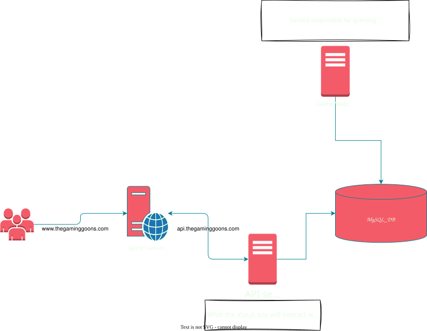

# Fantasy League webapp

- [Fantasy League webapp](#fantasy-league-webapp)
  - [Description](#description)
  - [App Diagram](#app-diagram)
  - [Tech Stack](#tech-stack)
  - [Deployment](#deployment)
    - [Docker with Docker Compose](#docker-with-docker-compose)
  - [Revenue](#revenue)

---
## Description
Basically I want to take what I've done in Python writing my `leagueOfGoons` discord bot and create a webapp that is public facing.

---
## App Diagram

---
## Tech Stack
The project is structured as a monorepo containing the API, Frontend, and Database.

1. **MySQL Database**
    - Used for persistent storage of users, lobbies, and game statistics.
    - Stores lobby configurations (points for Kills, Assists, etc.) and tracks game history for all participants.

2. **REST API (Go)**
    - Built using the [Gin](https://gin-gonic.com/) framework.
    - Interfaces with the MySQL database and the [Riot Games API](https://developer.riotgames.com/).
    - Handles user session management and lobby orchestration.

3. **Frontend (React)**
    - Built with [React](https://react.dev/) and bundled using [Vite](https://vitejs.dev/).
    - Provides the user interface for lobby creation, joining, and tracking progress.
    - Uses `react-cookie` for client-side identity management.

4. **Sentinel Service (Go)**
    - A background worker service responsible for periodically polling the Riot Games API and updating the database with the latest game results.

5. **Infrastructure**
    - **Docker Swarm**: Used for container orchestration across a cluster of nodes.
    - **Docker Hub**: Used as the central image registry for building and distributing service images.
    - **Docker Compose**: Used for defining the service stack.

---
## Deployment
The application is deployed on a private Docker Swarm cluster.

### Workflow
1. **Build**: Images are built locally or via CI for each service (DB, API, Web, Sentinel).
2. **Push**: Images are pushed to [Docker Hub](https://hub.docker.com/) to make them available to the cluster.
3. **Deploy**: The stack is deployed to the Docker Swarm cluster using a compose file, ensuring high availability and scalability across the nodes.

This approach allows for easy vertical and horizontal scaling by adding more nodes to the swarm or adjusting replica counts.

---
## Revenue
We can throw advertisements on the page. Not sure how much money that brings in, would have to investigate